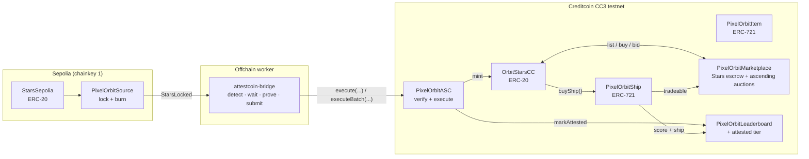

# 🚀 PixelOrbit

**Sector: Gaming** — an arcade game whose economy runs on Creditcoin.

[](https://creditcoin.org)
[](contracts/test)

> **In one paragraph.** PixelOrbit is an arcade game whose entire economy runs
> on **Stars**, and whose Stars arrive through the **Attestcoin Protocol**:
> players lock Stars on Sepolia, an offchain worker proves the lock to
> Creditcoin CC3 testnet, and the onchain Attestcoin contract verifies the
> proof before minting a single Star. No proof means no Stars, and no Stars
> means no ships, no marketplace bids, and no progression — readability is the
> core loop, not a side feature. Jump to
> [Attestcoin Protocol Integration Summary](#-attestcoin-protocol-integration-summary),
> or straight to the honest caveats in
> [Trust boundaries](#-trust-boundaries).

## The problem

Cross-chain game economies usually trust a bridge operator: someone holds the
keys, attests the deposits, and can be compromised, coerced, or simply go
offline. A game that mints currency on one chain because a server *says* a
deposit happened elsewhere has a single point of forgery.

The Attestcoin Protocol removes that operator. Sepolia state becomes
*readable* on Creditcoin with cryptographic proofs verified onchain — the game
contracts never take anyone's word for a lock. *(BUIDL CTC 2026 Fall, Gaming
track: in-game economies, asset ownership, and player-driven marketplaces.)*

## What PixelOrbit is

**A bridge-to-play economy: the only way to obtain Stars on Creditcoin is to
prove a Sepolia lock through Attestcoin, and everything in the game spends
Stars.**

Stars buy ships (Fighter free, Nautolan 2, Nairan 5, Klaed 10), settle
marketplace listings and ascending-auction bids, and gate progression. Bridged
players additionally carry an **attested tier** on the leaderboard. When you
want out of a position, the marketplace — not a redemption desk — is the exit.



---

### 🌟 Key Features

**Attestcoin bridge**

- **Sepolia source lock** — `lock(amount, nonce, recipient)` pulls Stars,
  burns them one-way, and emits `StarsLocked`. The event signature is frozen:
  ASC decoding depends on it
- **Offchain readability worker** — detects locks, waits for Sepolia
  attestation via the `0xFD3` ChainInfo precompile, builds Merkle plus
  continuity proofs from the prover, and submits to the ASC in batches of up
  to 10 sharing one continuity proof
- **Onchain verify-decode-execute** — the ASC checks the chainkey, verifies
  via the `0xFD2` BlockProver precompile, binds the lock to the exact source
  contract, marks `keccak256(source, player, nonce)` before any external call,
  then mints Stars and attests the player. Replays revert
- **Bridge tracker UI** — a live `locking` → `waiting-attestation` →
  `proving` → `submitting` → `minted` timeline that survives closing the modal

**The game and its economy**

- **On-chain spaceships** — ERC-721 ships with nine distinct stats,
  purchasable with Stars
- **Mintable game items** — ERC-721 loot with on-chain rarity rolls
- **Stars marketplace** — fixed-price listings and transparent ascending
  auctions, NFT held in escrow, protocol fee capped at 5%
- **On-chain leaderboard** — global and per-ship, with settable usernames and
  an ASC-gated ✓ ATTESTED tier for bridged players
- **In-game How To Play guide** — a mission-briefing modal (controls, energy,
  power-ups) reachable from the "Ready for Mission?" panel
- **Two-finger touch combat** — first finger steers and fires the volley; hold
  a second finger anywhere to fire the energy beam
- **Pilot profile & asset dashboard** — owned ships and items, Stars/tCTC
  balances, live bids, and portfolio value

### 🛠️ Tech Stack

| Layer | Technology |
|-------|-----------|
| **Blockchain** | Creditcoin CC3 testnet (chain id 102031) + Sepolia source (chainkey 1) |
| **Currency** | Stars (ERC-20: `StarsSepolia` on Sepolia, `OrbitStarsCC` on CC3) |
| **Attestcoin infra** | BlockProver precompile `0xFD2`, ChainInfo precompile `0xFD3`, `@gluwa/usc-sdk` prover + proof builder |
| **Smart Contracts** | Solidity ^0.8.24 (compiled with 0.8.26, Cancun) + Hardhat — **247 tests** |
| **Bridge worker** | TypeScript + `viem` on `node --test` — 91 tests |
| **Frontend** | Next.js 16 + React 19 + TypeScript |
| **Wallet** | RainbowKit + wagmi v2 + viem (Creditcoin-first, Sepolia for locks) |
| **UI** | TailwindCSS + Motion |
| **State** | Zustand + SWR |

---

## 📦 Smart Contracts

### DEPLOY-STATUS (testnet)

> All addresses below are **DEPLOYED** on public testnets (Creditcoin CC3,
> chain id 102031, + Sepolia source, chainkey 1), verified against
> `.env.local`, `contracts/.env`, and `worker/attestcoin-bridge/.env`.
> Linked-decoder note: the ASC and price oracle link the vendored
> EvmV1Decoder library internally (decoder constructor arg removed: ASC 6→5,
> oracle 4→3) — only the addresses in this table are current; any older
> ASC/oracle address is **stale**.

| Contract | Chain | Address | Description |
|----------|-------|---------|-------------|
| StarsSepolia | Sepolia | `0xCd9372ceD97f5f3D0E85980EB0B8550D1ba02e4F` | Stars ERC-20, test issuance (frontend derives via `source.stars()`) |
| PixelOrbitSource | Sepolia | `0x14c5A97d895e148Fe84C676c02b127e49dB5feAa` | Lock + burn, emits `StarsLocked` |
| OrbitStarsCC | Creditcoin CC3 | `0xfE40F15731c0594a4d170267203497534232211B` | Stars ERC-20, ASC-only minter |
| PixelOrbitShip | Creditcoin CC3 | `0x89C144D6D29bEcC007873b3072eC45b2d2eAC63B` | Ship NFT, Stars pricing, ASC-gated bridged mints |
| PixelOrbitItem | Creditcoin CC3 | `0x952Ed3Ea5800510539AD54413F9daf399F5bd7e8` | Item NFT, ASC-gated bridged mints |
| PixelOrbitMarketplace | Creditcoin CC3 | `0x7807F985C239DB19803A98f77e72a62CC44931E5` | Fixed price + ascending auctions in Stars |
| PixelOrbitLeaderboard | Creditcoin CC3 | `0x4818ff89B71B919B54Adb230f3a56B86CEc42b09` | Open scores + ASC attested tier |
| PixelOrbitASC | Creditcoin CC3 | `0x49e8C89E839038aF1B8023F2661Ce114346F2497` | Attestcoin verifier + executor |
| PixelOrbitPriceOracle | Creditcoin CC3 | `0x7fA2816037b3034cB66495899B0fD02E97E0F16f` | Attested Chainlink ETH/USD relay, gates 20% flash sale only |
| StarsSale | Sepolia | `0x7C6621dB4BfFbB27e04b0569A566CF5EbB013Cc3` | Sepolia Stars sale door (ETH) |
| StarsSaleCC3 | Creditcoin CC3 | `0x30bF51940a1D7BfA7D7dcc64aC316ee1d61988E7` | Creditcoin Stars sale door (tCTC) |

### Contract Architecture

```
PixelOrbitSource (Sepolia)
├── lock(amount, nonce, creditcoinRecipient) → pulls Stars, burns, emits StarsLocked
├── usedNonces(player, nonce) → per-player replay guard
└── stars() → the StarsSepolia token (the frontend derives the token from this)

PixelOrbitASC (Creditcoin)
├── execute(...) / executeBatch(...) → verify via 0xFD2, decode via the linked
│                                      EvmV1Decoder library, check source,
│                                      mark executedLocks, mint Stars, mark
│                                      attested, emit BridgeExecuted /
│                                      BridgeBatchExecuted
├── executedLocks(key) → keccak256(source, player, nonce), single-use guard
├── setShip(address) / setItem(address) → staged for future direct-bridge mints (unused in v1)
└── source / sourceChainKey / blockProver / starsCC / leaderboard → immutable bridge bindings

PixelOrbitShip (ERC-721Enumerable)
├── getShipStarsPrice(shipTypeIndex) → the stored Stars price (Fighter 0, Nautolan 2, ...)
├── buyShip(shipTypeIndex) → Stars transferFrom + mint
├── mintBridged(to, shipTypeIndex) → ASC-only
├── setAsc(address) → owner wires the ASC
├── getShipStats(tokenId) / getShipType(index) / getShipTypeCount()
└── withdrawStars() → owner drains accumulated sale revenue

PixelOrbitItem (ERC-721Enumerable)
├── mintBridged(to, nonce) → ASC-only, replay-safe, rarity from prevrandao
├── mintItem(to, itemTypeIndex) → owner path
├── setAsc(address) → owner wires the ASC
└── getTokenRarity(tokenId) / getItemType(index) / getItemTypeCount()

PixelOrbitMarketplace (Stars escrow, NFT custody on listing)
├── createListing(nftContract, tokenId, price, listingType, auctionDuration)
├── buyItem(listingId) → Stars transferFrom, fixed price only
├── placeBid(listingId, amount) → transparent ascending bid, immediate refund on outbid
├── finalizeAuction(listingId) → NFT to winner, Stars minus fee to seller
├── cancelListing(listingId) / updatePrice(listingId, newPrice)
└── feeOn(price) / setFeeConfig(bips, recipient) → capped at 5%

PixelOrbitLeaderboard
├── submitScore(score, shipName) → open base path
├── markAttested(player) → ASC-only attested tier
├── attestedPlayer(player) → the ✓ ATTESTED badge source
├── setAsc(address) → owner wires the ASC
└── setUsername / getUserStats / getShipBestScore / getAllUserStats / getTotalPlayers
```

---

## 🔗 Attestcoin Protocol Integration Summary

Readability is the core loop: **no proof → no Stars → no ships/progression.**

1. **Lock (Sepolia).** The player approves Stars and calls
   `PixelOrbitSource.lock(amount, nonce, creditcoinRecipient)`. Stars are
   pulled in and **burned** — the bridge is one-way, there is no refund path —
   and `StarsLocked(player, amount, nonce, creditcoinRecipient)` is emitted.
2. **Wait + prove (offchain).** The `attestcoin-bridge` worker detects the
   event (after 12 source confirmations against reorgs), waits until the
   Sepolia height is attestable via the `0xFD3` ChainInfo precompile, fetches
   Merkle plus continuity proofs from the prover, and packs the ASC call.
   Locks sharing a block are batched up to 10 per shared continuity proof.
3. **Verify + execute (Creditcoin).** `PixelOrbitASC.execute` checks
   the chainkey (`1`), verifies through the `0xFD2` BlockProver precompile,
   decodes via the linked EvmV1Decoder library (vendored, no decoder
   deployment), binds the decoded lock to the
   exact source contract, marks the `(source, player, nonce)` key before any
   external call, then mints Stars to the recipient and flags them attested
   on the leaderboard (batched locks go through `executeBatch` with per-index
   success events).
4. **Play.** Bridged Stars buy ships, bid in Stars-settled ascending auctions,
   and the attested tier follows the player on the leaderboard.

Execution is **permissionless** — anyone holding a valid proof may call the ASC.

---

## 🚨 Trust boundaries

Stated plainly, because a bridge claim is only worth what its weakest
assumption is worth.

- **The proof binding is proven offline, not yet live.** The ASC and
  oracle match the canonical SDK/reference ABIs (single + batch view
  `verify` plus the linked `EvmV1Decoder.decodeTransactionType2` library
  call, selector-verified against the compiled artifacts and the SDK
  `block_prover.json`) and execute the recorded Sepolia lock blob offline
  (`contracts/test/live-blob.test.ts`) — the live CC3 retry in the runbook
  is what closes this, and it has not run yet.
- **The source burn is one-way.** Locked Stars cannot be refunded or unlocked.
  A mistyped recipient still mints — to the mistyped address.
- **The worker is liveness, not safety.** A stopped or malicious worker can
  delay mints but cannot forge them (proofs verify onchain) or double-mint
  them (the ASC is the final replay guard). Anyone can submit a valid proof.
- **Deployed on testnet.** Every address in DEPLOY-STATUS is live (CC3 +
  Sepolia). Test counts (247 contract, 91 worker, 125 frontend) cover
  the bridge logic against mocks; live CC3 verification follows the runbook.

---

## 📤 Submission Snapshot (BUIDL CTC 2026 Fall)

| Submission field | Value |
|---|---|
| Project Name | PixelOrbit |
| Project Logo | `public/logo.svg` (static SVG, ships in repo) |
| Project Sector | Gaming |
| Project Description | Bridge-to-play arcade economy on Creditcoin: Stars only arrive via proven Sepolia locks, and everything in the game spends Stars. |
| Attestcoin Protocol Integration Summary | Sepolia `lock` burn → offchain worker waits/proves via `0xFD3` + prover → CC3 ASC verifies via `0xFD2` and mints Stars. See [Attestcoin Protocol Integration Summary](#-attestcoin-protocol-integration-summary). |
| GitHub Repository URL | `https://github.com/ikhsanRamadhan/pixelorbit-ctc` |
| Project Deck or Whitepaper | [https://drive.google.com/file/d/1z1Hx6--gvoaq0neni8O2qZj_-B57DDle/view?usp=sharing](https://drive.google.com/file/d/1z1Hx6--gvoaq0neni8O2qZj_-B57DDle/view?usp=sharing) |
| Prototype Demo Video URL | [https://www.youtube.com/watch?v=w5bCRJyFVvU](https://www.youtube.com/watch?v=w5bCRJyFVvU) |
| Team Size | 1 |

## 📋 Bounty Submission Mapping

This project is submitted for **BUIDL CTC 2026 Fall, Gaming track**.

| Requirement | Implementation |
|---|---|
| Project sector | Gaming — bridge-to-play arcade economy on Creditcoin |
| Attestcoin integration code | `contracts/attestcoin/` (source, ASC, Stars) + `worker/attestcoin-bridge/` + `src/services/bridge*.ts` + `BridgeModal.tsx` |
| Deployed on a testnet | Creditcoin CC3 + Sepolia — deployed |
| In-game economies | Stars-only pricing for ships, marketplace settlement, auction bids |
| Asset ownership | ERC-721 ships + items, escrowed marketplace custody |
| Player-driven marketplaces | Fixed-price listings + transparent ascending auctions in Stars |
| Dual Stars sale doors | `contracts/attestcoin/StarsSale.sol` (Sepolia ETH) + `StarsSaleCC3.sol` (CC3 two-way door: open `buy`, instant `sellStars` sell-back at 8 tCTC, FIFO `depositStars` consignment with pull `withdrawProceeds`) — inventory-only, nominal testnet prices, no mint rights; `src/services/sale.ts` + `BuyStarsPanels.tsx` in the Bridge modal |
| Prototype demo video | [https://www.youtube.com/watch?v=w5bCRJyFVvU](https://www.youtube.com/watch?v=w5bCRJyFVvU) |
| Project deck / whitepaper | [https://drive.google.com/file/d/1z1Hx6--gvoaq0neni8O2qZj_-B57DDle/view?usp=sharing](https://drive.google.com/file/d/1z1Hx6--gvoaq0neni8O2qZj_-B57DDle/view?usp=sharing) |

### Attestcoin depth evidence (summary)

33 load-bearing surfaces (27 Attestcoin, mock-verified, + 6 Stars-sale
doors, Hardhat/node-tested).

| Surface group | Count | Examples |
|---|---|---|
| Onchain bindings + precompiles | 5 | `0xFD2` + `verify`, linked decoder library, `0xFD3` + wait loop |
| Prover service | 6 | Builder URL, `ProofBuilder`, `waitUntilHeightAttested`, `getProof`, `getBatchProof`, adapters |
| Proof shapes | 4 | `AttestationProof`, `AttestationBatch`, `VerifiedLock`, `VerifiedPrice` |
| Entry points | 4 | `execute`, `executeBatch`, `updatePrice`, `setFeedEmitter` |
| Events | 4 | `BridgeExecuted`, `BridgeBatchExecuted`, `PriceUpdated`/`PriceFeedUpdated`, `AnswerUpdated` |
| Config + consumers + dashboard | 4 | Proxy default/`PRICE_FEEDS`, Ship sale gate, banner, dashboard |
| Sale doors | 6 | `buy` exact-payment doors, CC3 sell-back + consignment with solvency guard, owner controls, Buy Stars panels |

### 👥 Team (solo placeholder — details ship with the submission form)

| Field | Value |
|---|---|
| First & Last Name | MUHAMMAD IKHSAN RAMADHAN |
| Email | ikhsandadan@gmail.com |
| Telegram ID | @ikhsanashki |
| X / Twitter | [@Ikhsan_dadan](https://x.com/Ikhsan_dadan) |
| LinkedIn | [MuhammadIkhsanRamadhan](https://www.linkedin.com/in/muhammad-ikhsan-ramadhan-823004232/) |
| Short Bio | Solo builder, bridge-to-play arcade economy on Creditcoin |
| Role within the team | Developer |
| Country of Residence | INDONESIA |
| Country of Citizenship | INDONESIA |

---

## 🚀 Getting Started

### Prerequisites

- Node.js 18+
- A wallet with tCTC from the Creditcoin Discord `/faucet` (Creditcoin CC3
  gas) and Sepolia ETH from a Sepolia faucet (lock gas)

### Installation

```bash
git clone https://github.com/ikhsanRamadhan/pixelorbit-ctc.git
cd pixelorbit-ctc
npm install
```

### Environment Setup

Copy `.env.example` to `.env.local` and fill in the addresses printed by the
deploy scripts. Live deployed.
values:

```env
NEXT_PUBLIC_NETWORK=creditcoinTestnet
NEXT_PUBLIC_WALLETCONNECT_PROJECT_ID=your_project_id

# PixelOrbit contracts on Creditcoin CC3 testnet (chain id 102031).
# Printed by `npm run --prefix contracts deploy:creditcoin`.
NEXT_PUBLIC_SHIP_CONTRACT_ADDRESS=0x89C144D6D29bEcC007873b3072eC45b2d2eAC63B
NEXT_PUBLIC_ITEM_CONTRACT_ADDRESS=0x952Ed3Ea5800510539AD54413F9daf399F5bd7e8
NEXT_PUBLIC_MARKETPLACE_CONTRACT_ADDRESS=0x7807F985C239DB19803A98f77e72a62CC44931E5
NEXT_PUBLIC_LEADERBOARD_CONTRACT_ADDRESS=0x4818ff89B71B919B54Adb230f3a56B86CEc42b09
NEXT_PUBLIC_STARS_ADDRESS=0xfE40F15731c0594a4d170267203497534232211B
NEXT_PUBLIC_ASC_ADDRESS=0x49e8C89E839038aF1B8023F2661Ce114346F2497
NEXT_PUBLIC_PRICE_ORACLE_ADDRESS=0x7fA2816037b3034cB66495899B0fD02E97E0F16f

# Sepolia source lock (chainkey 1), printed by
# `npm run --prefix contracts deploy:sepolia`.
NEXT_PUBLIC_SOURCE_ADDRESS=0x14c5A97d895e148Fe84C676c02b127e49dB5feAa

# Dual Stars sale doors (empty disables the Buy Stars panels with a reason).
NEXT_PUBLIC_SALE_ADDRESS=0x7C6621dB4BfFbB27e04b0569A566CF5EbB013Cc3
NEXT_PUBLIC_CC_SALE_ADDRESS=0x30bF51940a1D7BfA7D7dcc64aC316ee1d61988E7
# Sepolia Stars token — optional, the bridge derives it at runtime from
# PixelOrbitSource.stars() when empty.
# NEXT_PUBLIC_SEPOLIA_STARS_ADDRESS=0xCd9372ceD97f5f3D0E85980EB0B8550D1ba02e4F

# Attestcoin readability endpoints.
NEXT_PUBLIC_PROVER_URL=https://prover.cc3-testnet.creditcoin.network/
NEXT_PUBLIC_DASHBOARD_URL=https://dashboard.cc3-testnet.creditcoin.network/
NEXT_PUBLIC_SEPOLIA_RPC_URL=https://ethereum-sepolia-rpc.publicnode.com
```

Contract-side deploy variables live separately in `contracts/.env.example`;
worker variables in `worker/attestcoin-bridge/.env.example`. Never commit
`.env.local`, `contracts/.env`, or `worker/attestcoin-bridge/.env`.

### Run Development Server

```bash
npm run dev
```

Open [http://localhost:3000](http://localhost:3000)

### Smart Contract Development

```bash
cd contracts
npm install

# Compile — Solidity 0.8.26, Cancun, optimizer 200 runs
npx hardhat compile

# Run tests (247 tests)
npx hardhat test

# Deploy the Sepolia source (StarsSepolia + PixelOrbitSource)
npm run deploy:sepolia

# Deploy everything on Creditcoin CC3 (needs SOURCE_ADDRESS in contracts/.env)
npm run deploy:creditcoin

# Refresh the frontend ABIs after any contract change; the result must be a
# clean `git status` under src/lib/abis
npm run export-abis
```

Test counts by suite: **247 total** (attestcoin source, StarsCC, ASC single +
batch, live-blob regression, item incl. run-crate claims, leaderboard,
marketplace, ship incl. flash sale, price oracle, Sepolia + CC3 sale doors
incl. sell-side solvency guard).
The bridge worker carries a further 91 under `node --test`, and the
frontend 125.

### Bridge Worker Development

```bash
cd worker/attestcoin-bridge
npm install

# Build + run the 91-test suite
npm test

# Run against testnet (fill .env first, keep it running)
npm run build
npm start
```

---

## 🎯 How to Play

1. **Connect Wallet** — Click "Connect" to link your wallet on Creditcoin CC3
2. **Get tCTC** — Creditcoin Discord `/faucet` for gas
3. **Get Stars** — Open the Bridge modal, lock Stars on Sepolia (you will be
   asked to switch networks and back); the tracker walks the lock through
   attestation, proving, and the ASC mint. The burn is one-way: check the
   recipient address before confirming
4. **Buy a Ship** — Visit the dealership; ships are priced in Stars (Fighter
   free, Nautolan 2, Nairan 5, Klaed 10)
5. **Play** — Shoot aliens, survive waves, pick up salvage crates and power-ups
6. **Game Over** — Submit your score to the leaderboard; bridged players carry
   the ✓ ATTESTED badge
7. **Marketplace** — List items at a fixed price, or run a **transparent
   ascending auction** where each new bid must exceed the current highest and
   outbid Stars are refunded immediately. Track your own bids from the same
   panel
8. **Leaderboard** — Global and per-ship rankings; your pilot profile shows
   your best run, your ships and your item inventory

---

## 🏗️ Project Structure

```
pixelorbit/
├── contracts/                    # Hardhat workspace — 247 tests
│   ├── attestcoin/
│   │   ├── StarsSepolia.sol            # Sepolia Stars ERC-20
│   │   ├── PixelOrbitSource.sol        # Sepolia lock + burn, emits StarsLocked
│   │   ├── OrbitStarsCC.sol            # Creditcoin Stars, ASC-only minter
│   │   ├── PixelOrbitASC.sol           # Attestcoin verifier + executor
│   │   └── MockBlockProver.sol         # Test double for 0xFD2
│   ├── contracts/
│   │   ├── PixelOrbitShip.sol            # ERC-721 ships, Stars pricing
│   │   ├── PixelOrbitItem.sol            # ERC-721 items, ASC-gated mints
│   │   ├── PixelOrbitMarketplace.sol     # Fixed price + ascending auctions
│   │   ├── PixelOrbitLeaderboard.sol     # Open scores + attested tier
│   │   └── mocks/                        # Local ERC-20/721 doubles
│   ├── test/                     # 7 suites (see Smart Contract Development)
│   ├── scripts/                  # deploy-sepolia-source, deploy-creditcoin,
│   │                             #   export-abis, single-contract deploys
│   └── typechain-types/          # Generated — regenerate, never hand-edit
├── worker/attestcoin-bridge/     # Readability worker — 91 tests
│   ├── src/                      # config, source logs, prover shaping,
│   │                             #   submitter, chain-info wait, state, index
│   └── .env.example              # Worker env template — copy to .env
├── src/
│   ├── app/
│   │   ├── page.tsx · layout.tsx · providers.tsx · actions.ts
│   │   └── api/
│   │       └── game/start              # run token issuance
│   ├── components/
│   │   ├── layout/               # ClientProviders, Gameover, backgrounds
│   │   ├── ui/                   # 15 components — marketplace, dealership,
│   │   │                         #   profile, leaderboard, bridge modal
│   │   └── utils/                # Ship, item and enemy data + sorting
│   ├── game/                     # Canvas engine: loop, physics, spatial grid,
│   │                             #   renderer, HUD bridge, audio, perf monitor
│   ├── hooks/                    # useMarketplace, useLeaderboard, usePilotProfile,
│   │                             #   useNow, useModalA11y
│   ├── services/                 # Chain I/O — 13 modules:
│   │   ├── bridge.ts             #   Sepolia approve+lock, ASC watch, retry
│   │   ├── bridge-store.ts       #   module-level timeline store
│   │   ├── bridge-logic.ts       #   chain helpers, 4902 fallback, polling
│   │   ├── marketplace.ts · user-bids.ts · portfolio.ts
│   │   └── wallet.ts · ships.ts · items.ts · leaderboard.ts · …
│   ├── stores/                   # Zustand: game-store, wallet-store
│   └── lib/
│       ├── contracts.ts · abis/  # Addresses + exported ABI JSON
│       ├── chains.ts · wagmi.ts · refresh.ts · ui-tokens.ts
│       └── __tests__/            # Encoding tests
├── public/                       # Static assets
├── .env.example                  # App env template — copy to .env.local
├── contracts/.env.example        # Deploy env template — copy to contracts/.env
└── README.md                     # This file
```

---

## 🔗 Links

**This project**

- **Repository**: [https://github.com/ikhsanRamadhan/pixelorbit-ctc](https://github.com/ikhsanRamadhan/pixelorbit-ctc)
- **Live demo (Creditcoin CC3)**: pending deploy — see DEPLOY-STATUS above
- **Project logo**: [public/logo.svg](public/logo.svg)
- **Project deck**: [https://drive.google.com/file/d/1z1Hx6--gvoaq0neni8O2qZj_-B57DDle/view?usp=sharing](https://drive.google.com/file/d/1z1Hx6--gvoaq0neni8O2qZj_-B57DDle/view?usp=sharing)
- **Demo video**: [https://www.youtube.com/watch?v=w5bCRJyFVvU](https://www.youtube.com/watch?v=w5bCRJyFVvU)

**Creditcoin**

- **Creditcoin**: [https://creditcoin.org](https://creditcoin.org)
- **Attestcoin docs**: [https://docs.creditcoin.org/creditcoin-usc](https://docs.creditcoin.org/creditcoin-usc)
- **Chains & environments**: [https://docs.creditcoin.org/creditcoin-usc/usc-chains-environments](https://docs.creditcoin.org/creditcoin-usc/usc-chains-environments)
- **Guided tutorials**: [https://docs.creditcoin.org/creditcoin-usc/guided-tutorials](https://docs.creditcoin.org/creditcoin-usc/guided-tutorials)
- **Attestcoin SDK**: [https://docs.creditcoin.org/creditcoin-usc/dapp-builder-infrastructure/usc-sdk](https://docs.creditcoin.org/creditcoin-usc/dapp-builder-infrastructure/usc-sdk)
- **CC3 Blockscout**: [https://creditcoin-testnet.blockscout.com](https://creditcoin-testnet.blockscout.com)
- **Sepolia explorer**: [https://sepolia.etherscan.io](https://sepolia.etherscan.io)

---

## 📄 License

MIT
